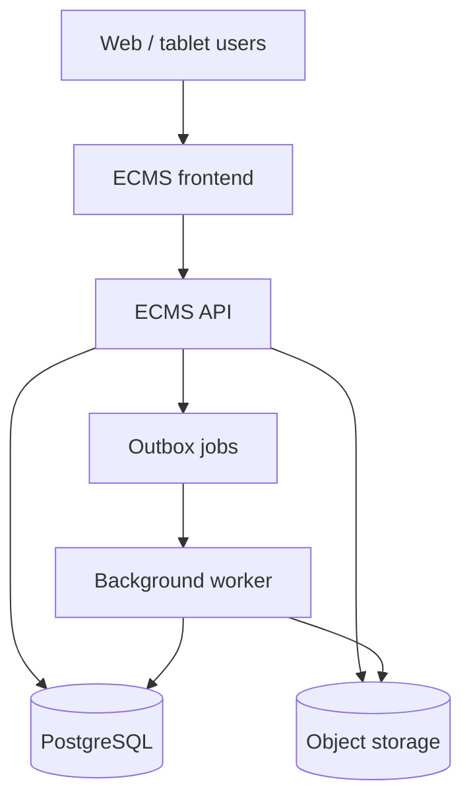
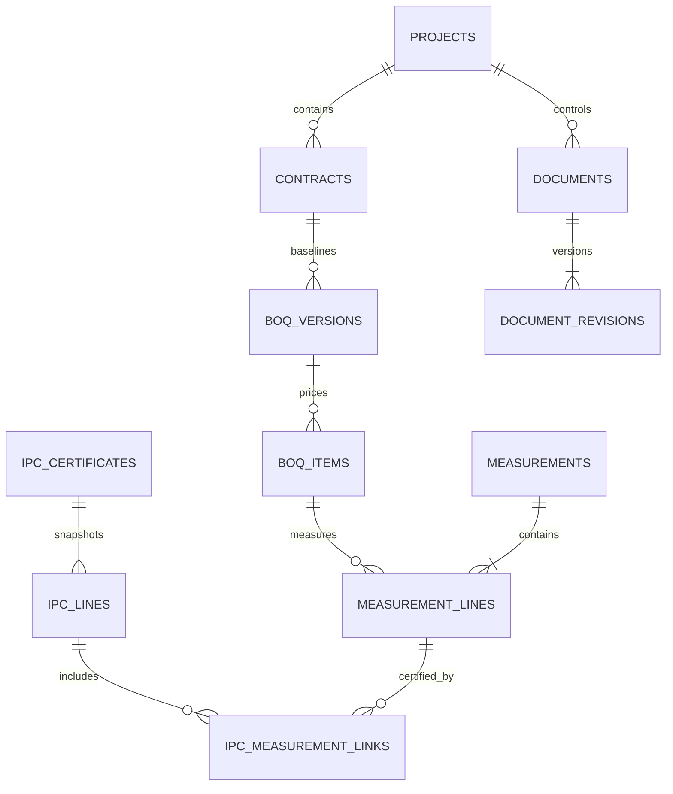
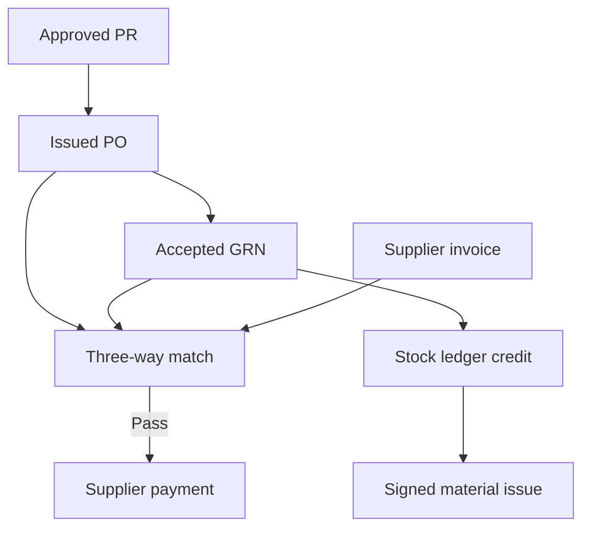

# ECMS MVP Technical Blueprint

## 1. Product decision

Build the MVP as a **modular monolith**:

- One responsive web frontend.
- One transactional API organized into domain modules.
- One background worker for imports, OCR, document previews, notifications, and report generation.
- PostgreSQL as the authoritative database.
- S3-compatible object storage for source files, drawings, photos, and generated reports.
- A durable audit log and an outbox table for reliable background work.

This is deliberately not a collection of microservices. The domain boundaries below make later extraction possible, but the MVP remains simple to deploy, debug, and demonstrate.



## 2. The MVP promise

The first release must complete one end-to-end commercial-control loop:

1. Set up a project and contract.
2. Import the approved BOQ from Excel.
3. Upload the contract and drawings, preserve their revisions, and make them searchable.
4. Record measured work against BOQ items and road chainage.
5. Submit and verify measurements with evidence.
6. Assemble an IPC from accepted measurements.
7. Calculate deductions, materials on site, advance recovery, retention, VAT, and net payment from versioned contract rules.
8. Route the IPC through review and certification.
9. Export the certificate and retain a complete audit trail back to source cells, pages, drawings, and approvals.

The system must never use an Excel formula as live business logic. Excel is an import/export format. PostgreSQL records, versioned rules, and API calculations are the system of record.

### The commercial model ECMS must preserve

The core road/infrastructure case is a unit-price, re-measurement contract. The approved BOQ is both the priced scope and the measurement coding structure:

- The BOQ quantity is an estimate/baseline, not automatically the payable quantity.
- The contract or approved varied rate is the price per unit.
- Site records establish the quantity actually executed.
- The engineer/consultant independently accepts the payable quantity.
- Each IPC line snapshots `Previous + This Period = To Date`; only the current certified amount enters that period's payment calculation.
- A provisional sum is an allowance, not earned work. It becomes payable only through an authorized instruction/usage record.
- Retention, advance recovery, VAT split, price adjustment, and taxes are separate typed adjustments with clause/rule lineage.

This re-measurement model is the product's commercial core. A generic task tracker or document register does not replace it.

### Deliberate separation of authority

Two operating chains coexist:

- Employer chain: employer/client → engineer/consultant → certification/payment.
- Contractor chain: project manager → site engineer/storekeeper/foreman → crews, suppliers, and workers.

The contractor may submit work, but cannot certify its own IPC. A requester cannot approve their own demand; a purchaser/approver cannot receive the same goods; a storekeeper cannot issue material to themselves; a timesheet submitter cannot approve it; a certifier cannot record the corresponding payment. The database and permission model both preserve these separations.

### Reference implementation for the current demo

- Keep the existing Next.js/TypeScript frontend shell and replace hardcoded arrays with typed API queries.
- Use Better Auth for sessions and identity-provider integration; map the authenticated subject to `app_users.auth_subject`.
- Use Prisma for ordinary relational CRUD and transactions.
- Apply the companion SQL through migrations for PostgreSQL features that must not be reduced to ORM logic: partial unique indexes, check constraints, immutable-ledger triggers, payment gates, reporting views, and RLS helpers.
- Run imports, OCR, previews, exports, alerts, and AI findings in a separate worker process.
- Treat generated Prisma types as persistence types, not as the frontend API contract; expose explicit request/response schemas so database changes do not leak into screens.

## 3. MVP scope and boundaries

### Included

| Capability | MVP outcome |
|---|---|
| Tenancy and users | One platform can host several clients; every record is tenant- and project-scoped. |
| Projects and parties | Employer, engineer/consultant, contractor, subcontractor, supplier, and financier can be assigned to projects. |
| Contract controls | Key clauses and configurable numeric/date rules drive alerts and IPC calculations. |
| BOQ and cost baseline | Versioned hierarchical BOQ with sections, items, quantities, rates, provisional sums, and variations. |
| Field measurements | Quantity records by BOQ item, date, location, and chainage, with attachments and approval state. |
| IPCs | Periodic certificate workspace, line snapshots, adjustments, workflow, certification, and payment record. |
| Documents and drawings | Document register, revision history, transmittals, OCR text, page references, and current-revision control. |
| RFIs and inspections | Minimal field-quality loop connected to drawings, BOQ items, locations, and evidence. |
| Procurement and suppliers | Controlled supplier master; PR, quotation, PO, GRN, invoice, three-way match, and supplier payment. |
| Stores and materials | Warehouse/item master, material issue slips, immutable stock ledger, and stock counts. |
| Workforce and timesheets | Fixed worker roster, attendance, approved timesheets, payroll batch, and worker payment. |
| Fraud controls | Segregation of duties, hard payment gates, duplicate checks, control exceptions, and immutable decisions. |
| AI findings | Advisory anomaly/duplicate/OCR findings with human review; no autonomous approval or payment block. |
| Imports and exceptions | Repeatable staged import with row-level lineage, validation failures, and reconciliation. |
| Audit and notifications | Immutable state-change history and reliable notification jobs. |
| Reporting | Dashboard, BOQ progress, IPC statement, payment history, exception list, and source traceability. |

### Explicitly deferred

- Full Primavera or MS Project scheduling.
- Full accounting/general ledger, tendering marketplace, fleet telematics, and plant maintenance. The MVP retains only the procurement, stock, and payable controls needed for the three money streams.
- Full BIM/IFC model authoring.
- Native mobile apps and offline conflict resolution; the MVP web app can be installable and tablet-friendly.
- General-purpose no-code workflow design.
- AI contract interpretation as an autonomous decision maker. OCR and suggestions are allowed; a human approves every contractual value.

## 4. Personas, roles, and authority

Roles are project assignments, not global labels. A user may be a consultant QS on one project and a viewer on another.

| Role | Typical rights |
|---|---|
| Tenant administrator | Manage organizations, users, platform roles, and all tenant projects. |
| Employer project manager | View all project data; approve variations and certified IPCs; manage employer team. |
| Employer finance | Review certificate totals, record payment, view securities and tax breakdown. |
| Engineer / consultant lead | Administer contract controls; verify measurements; recommend or certify IPCs. |
| Quantity surveyor | Manage BOQ, review quantities, prepare/review IPC lines and adjustments. |
| Site inspector | Create inspections, verify site measurements, attach field evidence. |
| Contractor project manager | Submit measurements, RFIs, documents, and IPC applications. |
| Contractor quantity surveyor | Prepare measurement sheets, materials-on-site entries, and IPC applications. |
| Document controller | Register documents, revisions, transmittals, and drawing metadata. |
| Auditor / viewer | Read-only access, including history and source lineage where authorized. |

Permissions should be atomic, for example `boq.read`, `boq.manage`, `measurement.create`, `measurement.verify`, `ipc.prepare`, `ipc.certify`, `payment.record`, `document.issue`, and `audit.read`. Roles are bundles of permissions stored in PostgreSQL.

## 5. Frontend information architecture

### Application shell

- Top bar: tenant, project switcher, global search, notification inbox, help, user menu.
- Left navigation: Overview, Cost & BOQ, Field, IPCs, Contract, Documents, Issues, Reports, Setup.
- Project header: project code/name, contract status, parties, current reporting period, data-quality badge.
- Persistent context: selected project, currency, timezone, and contract; never infer them from a spreadsheet.

### Route map

| Route | Screen | Primary actions |
|---|---|---|
| `/projects` | Project portfolio | Create/open project; compare status and exceptions. |
| `/projects/:projectId/overview` | Project dashboard | Review progress, commercial position, upcoming obligations, and blockers. |
| `/projects/:projectId/cost/boq` | BOQ explorer | Browse hierarchy, filter, inspect item history, import a revision. |
| `/projects/:projectId/cost/variations` | Variation register | Draft, price, submit, approve, and incorporate a variation. |
| `/projects/:projectId/field/measurements` | Measurement register | Create, submit, verify, return, and include measurements in an IPC. |
| `/projects/:projectId/field/measurements/:id` | Measurement workspace | Edit quantities/chainage, attach evidence, review history. |
| `/projects/:projectId/field/rfis` | RFI register | Raise, answer, close, and link an RFI. |
| `/projects/:projectId/field/inspections` | Inspection register | Request inspection, complete checklist, record outcome. |
| `/projects/:projectId/procurement/requisitions` | Purchase requisitions | Request materials and route PM approval. |
| `/projects/:projectId/procurement/quotes` | Quote comparison | Capture comparable supplier offers and award reason. |
| `/projects/:projectId/procurement/orders` | Purchase orders | Issue supplier orders from approved demand. |
| `/projects/:projectId/procurement/receipts` | Goods receipts | Storekeeper checks quantity/specification against the PO. |
| `/projects/:projectId/procurement/invoices` | Supplier invoices | Perform PO/GRN/invoice three-way match and hold exceptions. |
| `/projects/:projectId/stores/stock` | Live stock ledger | View on-hand quantity by item/warehouse and trace movements. |
| `/projects/:projectId/stores/issues` | Material issues | Issue material to a work package/task with signed receipt. |
| `/projects/:projectId/workforce/roster` | Worker roster | Maintain authorized workers and trades. |
| `/projects/:projectId/workforce/timesheets` | Attendance/timesheets | Foreman records; PM approves; payroll consumes approved time only. |
| `/projects/:projectId/workforce/payroll` | Payroll batches | Calculate payable hours and record worker payment. |
| `/projects/:projectId/ipcs` | IPC register | Create period, compare requested/certified/paid totals. |
| `/projects/:projectId/ipcs/:id` | IPC workspace | Build lines, calculate adjustments, reconcile, review, certify, export. |
| `/projects/:projectId/contract` | Contract summary | See dates, parties, current value, securities, and key rules. |
| `/projects/:projectId/contract/clauses` | Clause register | Review obligations, source pages, and alerts. |
| `/projects/:projectId/documents` | Document register | Upload, revise, issue, search, and open files. |
| `/projects/:projectId/documents/:id` | Document viewer | Compare revision metadata, page OCR, links, and transmittals. |
| `/projects/:projectId/issues` | Exception console | Resolve import, data, contract, workflow, and calculation exceptions. |
| `/projects/:projectId/reports` | Report center | Generate dashboard, BOQ, IPC, payment, and audit reports. |
| `/projects/:projectId/setup/imports` | Import center | Upload, map, validate, commit, reconcile, and roll back a batch. |
| `/settings/organizations` | Organization setup | Manage legal entities and contacts. |
| `/settings/users` | Access setup | Invite users and assign tenant/project roles. |

### Screen anatomy

#### Project overview

- Contract value, certified-to-date, paid-to-date, retention held, and forecast balance.
- Physical progress based on accepted/certified BOQ quantities; show the basis and period.
- Current IPC status and responsible reviewer.
- Overdue contractual obligations and expiring securities.
- Unresolved import or calculation exceptions.
- Three-way-match holds, low/negative-stock attempts, unapproved timesheets, and segregation-of-duty violations.
- Recent measurements, RFIs, inspections, and documents.
- Data freshness timestamp and source-quality indicator.

#### BOQ explorer

- Tree/grid hybrid: section navigation on the left, items on the right.
- Columns: internal item number, source code, description, unit, original quantity, approved quantity, rate, amount, measured-to-date, certified-to-date, remaining quantity, variation impact.
- Never treat `source_code` as unique; the database UUID is the identity.
- Item drawer: rate history, variation history, measurement lines, IPC lines, source Excel cell, exceptions, audit history.
- Version comparison view between approved BOQ revisions.

#### Measurement workspace

- Header: number, date, contractor, inspector, work package, location, status.
- Lines: BOQ item, calculation method, dimensions, calculated quantity, submitted quantity, accepted quantity, unit, drawing reference, remarks.
- Road view: start/end chainage strip with overlap warnings.
- Evidence: photos, sketches, signed sheets, inspection, and relevant drawing revision.
- Action bar reflects state and permission: Save, Submit, Return, Verify, Reject, Add to IPC.
- Read-only snapshot after inclusion in a certified IPC; corrections require a new reversing or superseding measurement.

#### IPC workspace

- `Summary`: current/previous/cumulative amounts and contract caps.
- `Work`: BOQ lines sourced from accepted measurements, with variance explanations.
- `Materials on site`: eligibility, supporting invoices, current credit, and later recovery.
- `Adjustments`: price adjustment, dayworks, provisional sums, retention, advance recovery, withholding, VAT, and approved custom adjustments.
- `Reconciliation`: previous certificate + this period = cumulative, line by line and for totals.
- `Documents`: application, recommendation, certificate, supporting files.
- `Approvals`: workflow steps, comments, signatures/attestations, and timestamps.
- `Audit`: all changes, rule versions, and calculation version/hash.

#### Document control

- Three-pane layout: filters/register, preview, metadata/history.
- Current revision is unmistakable; superseded revisions remain accessible.
- Search document numbers, titles, OCR text, clause numbers, and drawing sheet titles.
- Links from a clause, measurement, RFI, inspection, BOQ item, or IPC open the correct revision and page, not merely the current file.

#### Exception console

- Categories: import, duplicate source code, broken formula, unmatched item, quantity overrun, missing evidence, expired contract control, calculation mismatch, workflow SLA.
- Filters: severity, module, assignee, source file/sheet/cell, status, age.
- Resolution records the chosen action, user, timestamp, and before/after value.

#### Procurement and store workspace

- The requisition shows the requesting user, task/work package, item/specification, quantity, need date, and PM approval.
- Quote comparison aligns supplier, specification, quantity, unit price, delivery date, taxes, and commercial terms. The selected supplier and written selection reason are immutable after PO issue.
- The PO is generated only from approved requisition demand and is versioned after issue.
- The GRN starts from the PO's expected lines. The storekeeper records received, accepted, and rejected quantity plus the actual specification and delivery-note evidence.
- The invoice page places PO, cumulative GRNs, and invoice lines side by side. Quantity, rate, specification, currency, tax, and total variances create match exceptions.
- `Approve for payment` is unavailable until a three-way match passes and the acting user has a compatible role.
- Posting an accepted GRN credits the stock ledger. Posting a signed material issue debits it and links the issue to a work package, task/cost code, and recipient.
- The UI never permits an undocumented direct stock balance edit. Stock corrections are approved ledger adjustments with reason and evidence.

#### Workforce and payroll workspace

- Only active worker-roster records appear in attendance and timesheets.
- Attendance captures project date, check-in/out or signed hours, foreman, and work package/cost code.
- A timesheet summarizes regular/overtime hours by worker and day; the submitter cannot approve it.
- Payroll consumes approved timesheet lines, snapshots the authorized rates, calculates gross/deductions/net, and locks the batch after approval.
- Worker payment is appended against an approved payroll line; it never rewrites hours or calculated gross pay.

#### Control and AI findings

- Hard controls are shown at the action that would violate them: self-approval, supplier not approved, missing GRN, failed three-way match, unlisted worker, or insufficient stock.
- Soft controls create review findings: unusual quantity jump, supplier price drift, repeated award pattern, suspicious invoice similarity, time-versus-cost divergence, or anomalous material consumption.
- Every AI finding shows the evidence, score, model/prompt version, and a required human disposition: confirm, dismiss, investigate, or convert to issue.
- AI cannot transition a workflow, approve a supplier, certify an IPC, post stock, approve payroll, or release payment.

### Reusable frontend components

- `ProjectContextHeader`
- `KpiCard`
- `Money`, `Quantity`, `Percent`, `Chainage`
- `StatusBadge` and `WorkflowStepper`
- `PermissionGate`
- `DataGrid` with saved columns and server-side pagination
- `BOQItemPicker`
- `ChainageRangeInput`
- `EvidenceUploader`
- `DocumentViewer`
- `SourceReference` and `SourceLineageDrawer`
- `CalculationBreakdown`
- `ReconciliationTable`
- `ExceptionBanner`
- `ApprovalActionBar`
- `AuditTimeline`

Every displayed commercial value should carry: value, currency/unit, period, source type, source record, calculation version, validation state, and last update time.

## 6. Backend modules

| Module | Owns | Does not own |
|---|---|---|
| Identity | Users, memberships, roles, permissions | Project business data |
| Projects | Project master, parties, locations, work packages | Contract calculations |
| Contracts | Contract master, clauses, rules, obligations, securities | BOQ transactions |
| Cost | BOQ versions/items, rates, variations | IPC approval state |
| Field | Measurements, RFIs, inspections, field evidence | Financial certification |
| IPC | Certificate snapshots, adjustments, MOS, workflow, payment | Raw document bytes |
| Procurement | Suppliers, requisitions, quotes, POs, receipts, invoices, three-way matching, supplier payments | Inventory balances or employer IPC certification |
| Inventory | Warehouses, material master, issues, counts, append-only stock ledger | Supplier selection or invoice approval |
| Workforce | Worker roster, attendance, timesheets, payroll batches, worker payments | General-ledger payroll accounting |
| Controls | Segregation-of-duty policies, hard control evaluations, exceptions | Domain workflow decisions |
| AI findings | Advisory anomaly and extraction results, evidence, human disposition | Approval, rejection, posting, or payment authority |
| Documents | File metadata, documents, revisions, pages, transmittals | Contract interpretation decisions |
| Imports | Staging, mappings, validation, lineage, exceptions | Authoritative records after commit |
| Workflow | Reusable definitions, instances, tasks, actions | Domain-specific calculation logic |
| Audit | Append-only audit events and outbox | Mutable business records |
| Reporting | Read models and exports | New transactional truth |

Modules share one PostgreSQL database in the MVP, but must not update another module's tables directly from controllers. Cross-module operations run through explicit application services in one database transaction.

## 7. PostgreSQL conventions

- PostgreSQL 16 or later.
- UUID primary keys generated with `gen_random_uuid()`.
- `timestamptz` for events; `date` for contract/reporting dates.
- `numeric(20,4)` for money and quantities; never `float` or `double precision` for commercial values.
- ISO 4217 three-letter currency codes.
- Linear chainage stored as integer millimetres to avoid parsing ambiguity; the UI formats `6930000` as `6+930.000`.
- File content lives in object storage; PostgreSQL stores immutable metadata, size, MIME type, storage key, checksum, and scanning state.
- JSONB is limited to calculation inputs, OCR metadata, imported source rows, and extension attributes. Core queryable fields remain relational.
- Every mutable aggregate has `row_version` for optimistic locking.
- Every state change is transactional and writes an audit event.
- Supplier, stock, and worker payments have separate records and approval gates; they are never mixed into an IPC table.
- Posted stock ledger entries are append-only. Corrections are new reversing/adjusting entries.
- An AI result is always stored as a finding, never as a domain status transition.
- Certified IPC and accepted measurement data are snapshots. Later BOQ/rate edits cannot rewrite history.
- Source identifiers from Excel are descriptive fields, not database identities.
- Use `deleted_at` only for drafts and administrative records. Certified, issued, or audited records are never physically or logically deleted; they are superseded or reversed.

## 8. Database inventory

The companion SQL file creates the following schema.

### Identity and access

| Table | Purpose |
|---|---|
| `tenants` | Customer boundary, default currency/timezone, settings. |
| `organizations` | Employer, consultant, contractor, supplier, and other legal entities. |
| `app_users` | Global human identities mapped to the authentication provider. |
| `tenant_memberships` | User participation in a tenant and optional home organization. |
| `roles` | Tenant/system role definitions. |
| `permissions` | Stable atomic permission keys. |
| `role_permissions` | Permissions granted to a role. |
| `tenant_member_roles` | Tenant-level role assignments such as tenant administrator. |
| `project_members` | User assignment to a project and organization. |
| `project_member_roles` | One or more roles for each project member. |

### Project and contract

| Table | Purpose |
|---|---|
| `projects` | Project master, dates, chainage, status, currency. |
| `project_organizations` | Project parties and their roles. |
| `locations` | Hierarchical physical locations and chainage ranges. |
| `work_packages` | Manageable packages for field/commercial records. |
| `contracts` | Contract value, dates, completion/DLP, tax and commercial settings. |
| `contract_parties` | Contract-specific employer, engineer, contractor, and other parties. |
| `contract_clauses` | Indexed clause register with source revision/page. |
| `contract_rules` | Typed, effective-dated values used by alerts/calculations. |
| `contract_obligations` | Due/fulfilled obligations derived from clauses and rules. |
| `contract_securities` | Performance, advance, retention, insurance, and other instruments. |

### Files and document control

| Table | Purpose |
|---|---|
| `stored_files` | Immutable object metadata and SHA-256 checksum. |
| `documents` | Stable document/drawing identity. |
| `document_revisions` | Versioned file and issue metadata; only one current revision. |
| `document_pages` | Page-level OCR text, thumbnail, rotation, and dimensions. |
| `document_links` | Links a fixed document revision/page to a domain record. |
| `transmittals` | Formal incoming/outgoing issue packages. |
| `transmittal_items` | Revisions included in a transmittal. |
| `record_attachments` | Evidence files linked to domain records. |

### Cost and BOQ

| Table | Purpose |
|---|---|
| `boq_versions` | Immutable/draft BOQ baselines and revisions. |
| `boq_sections` | Hierarchical BOQ headings. |
| `boq_items` | Priced items; source codes may repeat. |
| `boq_item_rates` | Effective-dated approved rate history. |
| `variations` | Variation order header, value, time impact, status. |
| `variation_items` | Quantity/rate changes or new items in a variation. |
| `provisional_sum_usages` | Approval and expenditure against provisional sums. |
| `daywork_sheets` | Daywork record header and approval state. |
| `daywork_lines` | Labour, plant, material, or other daywork components. |

### Field and quality

| Table | Purpose |
|---|---|
| `measurements` | Measurement header, context, submit/verify lifecycle. |
| `measurement_lines` | BOQ-linked quantities and calculation inputs. |
| `measurement_segments` | One or more chainage/location segments supporting a line. |
| `rfis` | Request-for-information register. |
| `rfi_responses` | Threaded formal responses. |
| `inspection_requests` | Inspection request, schedule, outcome, and linkages. |
| `inspection_check_items` | Checklist results. |
| `issues` | NCR, defect, commercial, document, safety, and data issues. |
| `issue_comments` | Issue discussion and status evidence. |

### Procurement, stores, and supplier payment

| Table | Purpose |
|---|---|
| `suppliers` | Controlled tenant supplier master and independent approval. |
| `cost_codes` | Project cost/activity coding shared by procurement, stores, and labor. |
| `warehouses` | Project storage locations and assigned storekeeper. |
| `inventory_items` | Controlled material/item specifications and units. |
| `purchase_requisitions` | Internal approved demand header. |
| `purchase_requisition_lines` | Requested item/specification/quantity and estimate. |
| `supplier_quotes` | Supplier offer header and commercial terms. |
| `supplier_quote_lines` | Comparable quote pricing against requisition lines. |
| `purchase_orders` | Binding supplier order and recorded award rationale. |
| `purchase_order_lines` | Ordered specification, quantity, price, and requisition link. |
| `goods_receipts` | Storekeeper receipt/inspection header against a PO. |
| `goods_receipt_lines` | Received/accepted/rejected quantities and actual specification. |
| `supplier_invoices` | Controlled invoice header, file hash/fingerprint, and payment state. |
| `supplier_invoice_lines` | Invoice quantity/rate/amount linked to a PO line. |
| `three_way_matches` | Match run and overall pass/exception decision. |
| `three_way_match_lines` | PO/GRN/invoice comparisons and tolerances by line. |
| `supplier_payments` | Payment appended only after a passed three-way match. |
| `material_issues` | Signed issue slip from store to a task/work package. |
| `material_issue_lines` | Issued quantity and stock item. |
| `stock_counts` | Controlled physical count event. |
| `stock_count_lines` | System quantity, counted quantity, variance, and approval. |
| `stock_ledger_entries` | Immutable receipt/issue/return/transfer/adjustment movements. |

### Workforce and payroll

| Table | Purpose |
|---|---|
| `workers` | Fixed project worker roster; no free-text payable names. |
| `attendance_records` | Daily check-in/out or signed attendance tied to roster/work package. |
| `timesheets` | Period header, foreman submission, PM approval, and lock. |
| `timesheet_lines` | Worker/day/cost-code hours and snapshotted rates. |
| `payroll_batches` | Approved payable period and aggregate totals. |
| `payroll_lines` | Worker gross, deductions, and net from approved time. |
| `worker_payments` | Actual payment appended to approved payroll lines. |

### Control and AI

| Table | Purpose |
|---|---|
| `control_rules` | Configurable hard/soft control definitions and thresholds. |
| `control_evaluations` | Immutable pass/fail/exception evidence for an attempted action. |
| `ai_findings` | Advisory model output, evidence, score, version, and human disposition. |

### IPC and payment

| Table | Purpose |
|---|---|
| `ipc_certificates` | Period, status, calculation version/hash, snapshot totals. |
| `ipc_lines` | BOQ item description/unit/rate/quantity snapshots. |
| `ipc_measurement_links` | Exact accepted measurement quantities included in an IPC line. |
| `ipc_adjustments` | Price adjustment, retention, advance, tax, VAT, and other additions/deductions. |
| `ipc_materials_on_site` | Invoice-supported material credit and later recovery. |
| `payments` | Employer payment record and deductions after certification. |

### Workflow, imports, and operations

| Table | Purpose |
|---|---|
| `workflow_definitions` | Versioned workflow for a subject type. |
| `workflow_definition_steps` | Ordered step, permission, SLA, and assignment rule. |
| `workflow_instances` | One execution against a measurement, IPC, variation, etc. |
| `workflow_tasks` | Assigned actionable step. |
| `workflow_actions` | Immutable submit/approve/return/reject history. |
| `import_jobs` | Import batch and overall state. |
| `import_sheets` | Excel sheet-level staging metadata. |
| `import_mappings` | Saved source-to-target mapping. |
| `import_rows` | Raw/normalized row, validation state, target identity. |
| `import_exceptions` | Row/file-level errors and human resolution. |
| `source_lineage` | Field-level trace from database value to source file/sheet/cell/page. |
| `notifications` | User inbox and delivery state. |
| `outbox_events` | Reliable jobs/integration events written with transactions. |
| `audit_events` | Append-only who/what/when/before/after record. |

## 9. Core relationships



Important relationship rules:

- `boq_items.source_code` is indexed but intentionally not unique.
- `measurement_lines` point to the BOQ item actually measured.
- `ipc_lines` copy the item number, description, unit, contract quantity, and rate into immutable snapshot columns.
- `ipc_measurement_links` prevents the same accepted quantity from silently being certified twice.
- `document_links` always identify a revision and optional page to preserve what a reviewer actually saw.
- A workflow instance references a domain subject by type and UUID; the application validates that the subject belongs to the same project.

The supplier-payment and material flow is separate from IPC certification:



## 10. State machines

### Measurement

`draft → submitted → verified → included`

- `submitted → returned → submitted`
- `submitted → rejected`
- `verified → returned` only before an IPC includes it.
- Included measurements become immutable. A correction is a new adjustment measurement.

### IPC

`draft → submitted → under_review → recommended → certified → paid`

- `submitted/under_review/recommended → returned → submitted`
- `draft/returned → cancelled`
- Certification locks all certificate lines, adjustments, materials-on-site entries, rule snapshots, and totals.
- Payment does not change certified amounts; it appends one or more payment records and changes the derived payment state.

### Variation

`draft → submitted → under_review → approved → incorporated`

- `submitted/under_review → returned → submitted`
- `submitted/under_review → rejected`
- An approved variation must be incorporated into a new BOQ version or linked effective rate before measurements use it.

### Documents

Revision states are `draft`, `submitted`, `accepted`, `rejected`, `superseded`, and `withdrawn`. Only an accepted/issued revision may be current. Issuing a new current revision supersedes the former current revision in the same transaction.

### Procurement and supplier invoice

- PR: `draft → submitted → approved` or `returned/rejected/cancelled`.
- PO: `draft → approved → issued → partially_received → fully_received → closed`.
- GRN: `draft → submitted → accepted` or `returned/rejected/cancelled`.
- Invoice: `draft → submitted → matching → exception|matched → approved_for_payment → partially_paid|paid`.
- Supplier payment insertion is database-blocked unless the invoice is `approved_for_payment` or `partially_paid` and has a passed match.

### Inventory

- GRN acceptance posts positive immutable ledger entries.
- Material issue posting creates negative immutable entries and is blocked if it would make stock negative.
- Stock count approval never updates a balance directly; it posts a signed variance adjustment.

### Workforce

- Timesheet: `draft → submitted → approved → included_in_payroll`.
- Payroll: `draft → calculated → submitted → approved → partially_paid|paid`.
- Approver and preparer/submitter must be different users.

## 11. Commercial calculation model

### General principles

- Calculation rules are keyed, typed, effective-dated contract records.
- A calculation service loads the rules effective on the IPC period end date.
- It calculates in high precision, rounds only at defined output boundaries, and records a detailed breakdown.
- Every calculation has `calculation_version`, `rule_snapshot`, and `calculation_hash`.
- A certified IPC never recalculates automatically.

### Work amount

For each BOQ item:

`current_work_amount = accepted_current_quantity × effective_rate`

`cumulative_quantity = previous_certified_quantity + current_quantity`

`cumulative_amount = previous_certified_amount + current_work_amount`

The service rejects an item if the cumulative accepted quantity exceeds the currently approved quantity unless an authorized overrun/variation rule exists.

### Certificate flow

1. Sum IPC work lines.
2. Add eligible materials on site and approved positive adjustments.
3. Deduct materials-on-site recovery and other negative adjustments.
4. Calculate retention from the configured basis and enforce its cap.
5. Calculate advance recovery after the configured start threshold and enforce full recovery before the configured completion threshold.
6. Apply price adjustment under its formula and ceiling.
7. Compute taxable subtotal, VAT, withholding, and other taxes according to configured bases.
8. Produce gross current amount, total deductions, net certified amount, and cumulative totals.

Each adjustment row records its sign, basis, percentage/rate, prior amount, current amount, cumulative amount, source clause, and human explanation.

### Jijiga demo rule seed

The supplied project files support the following initial values, subject to authorized review during setup:

| Rule | Demo value |
|---|---:|
| Contract amount | ETB 672,098,730.28 |
| Contract duration | 18 months, including 3 months mobilization |
| Defects liability period | 730 days |
| Performance security | 10% |
| Maximum subcontracting | 40% |
| Minimum IPC | ETB 5,000,000 |
| Retention | 5% |
| Advance maximum | 20% |
| Advance recovery start | 30% progress |
| Advance monthly recovery | 40% basis from the contract rule |
| Advance fully recovered | Before 80% progress |
| Delay damages | 0.1% per day, capped at 10% |
| Price-adjustment ceiling | 20% |
| VAT | 15% |
| Project chainage | 0+000 to 6+930 |

The December 2021 IPC can be loaded as a historical certified snapshot after reconciliation: work certified ETB 11,075,982.24, retention ETB 553,799.11, materials on site ETB 490,708.80, and net contractor payment ETB 11,843,590.59. The import must preserve any unexplained difference as an exception, not force the target to match.

## 12. API contract

Use versioned REST endpoints for the MVP. Commands return the updated aggregate, validation warnings, and `rowVersion`. Lists use cursor pagination.

### Projects and contract

- `GET /api/v1/projects`
- `POST /api/v1/projects`
- `GET /api/v1/projects/{projectId}`
- `PATCH /api/v1/projects/{projectId}`
- `GET /api/v1/projects/{projectId}/dashboard`
- `GET /api/v1/projects/{projectId}/contracts`
- `POST /api/v1/projects/{projectId}/contracts`
- `GET /api/v1/contracts/{contractId}/rules?effectiveOn=YYYY-MM-DD`
- `PUT /api/v1/contracts/{contractId}/rules/{ruleKey}`
- `GET /api/v1/contracts/{contractId}/obligations`

### BOQ and variations

- `GET /api/v1/contracts/{contractId}/boq/versions`
- `POST /api/v1/contracts/{contractId}/boq/versions`
- `GET /api/v1/boq-versions/{versionId}/items`
- `GET /api/v1/boq-items/{itemId}`
- `POST /api/v1/contracts/{contractId}/variations`
- `POST /api/v1/variations/{variationId}/submit`
- `POST /api/v1/variations/{variationId}/approve`
- `POST /api/v1/variations/{variationId}/incorporate`

### Measurements and field control

- `GET /api/v1/projects/{projectId}/measurements`
- `POST /api/v1/projects/{projectId}/measurements`
- `GET /api/v1/measurements/{measurementId}`
- `PATCH /api/v1/measurements/{measurementId}`
- `POST /api/v1/measurements/{measurementId}/lines`
- `POST /api/v1/measurements/{measurementId}/submit`
- `POST /api/v1/measurements/{measurementId}/verify`
- `POST /api/v1/measurements/{measurementId}/return`
- `POST /api/v1/projects/{projectId}/rfis`
- `POST /api/v1/projects/{projectId}/inspections`

### IPC and payment

- `GET /api/v1/contracts/{contractId}/ipcs`
- `POST /api/v1/contracts/{contractId}/ipcs`
- `GET /api/v1/ipcs/{ipcId}`
- `POST /api/v1/ipcs/{ipcId}/include-measurements`
- `POST /api/v1/ipcs/{ipcId}/adjustments`
- `POST /api/v1/ipcs/{ipcId}/materials-on-site`
- `POST /api/v1/ipcs/{ipcId}/calculate`
- `POST /api/v1/ipcs/{ipcId}/submit`
- `POST /api/v1/ipcs/{ipcId}/recommend`
- `POST /api/v1/ipcs/{ipcId}/certify`
- `POST /api/v1/ipcs/{ipcId}/return`
- `POST /api/v1/ipcs/{ipcId}/payments`
- `GET /api/v1/ipcs/{ipcId}/export?format=pdf|xlsx`

### Documents and imports

- `POST /api/v1/projects/{projectId}/documents`
- `POST /api/v1/documents/{documentId}/revisions`
- `POST /api/v1/document-revisions/{revisionId}/issue`
- `GET /api/v1/document-revisions/{revisionId}/pages/{pageNo}`
- `GET /api/v1/projects/{projectId}/search?q=`
- `POST /api/v1/projects/{projectId}/imports`
- `PUT /api/v1/imports/{jobId}/mapping`
- `POST /api/v1/imports/{jobId}/validate`
- `POST /api/v1/imports/{jobId}/commit`
- `POST /api/v1/import-exceptions/{exceptionId}/resolve`

### Procurement and stores

- `GET|POST /api/v1/projects/{projectId}/suppliers`
- `POST /api/v1/suppliers/{supplierId}/approve`
- `GET|POST /api/v1/projects/{projectId}/purchase-requisitions`
- `POST /api/v1/purchase-requisitions/{id}/submit`
- `POST /api/v1/purchase-requisitions/{id}/approve`
- `POST /api/v1/purchase-requisitions/{id}/quotes`
- `GET|POST /api/v1/projects/{projectId}/purchase-orders`
- `POST /api/v1/purchase-orders/{id}/issue`
- `GET|POST /api/v1/projects/{projectId}/goods-receipts`
- `POST /api/v1/goods-receipts/{id}/accept`
- `GET|POST /api/v1/projects/{projectId}/supplier-invoices`
- `POST /api/v1/supplier-invoices/{id}/run-three-way-match`
- `POST /api/v1/supplier-invoices/{id}/approve-for-payment`
- `POST /api/v1/supplier-invoices/{id}/payments`
- `GET /api/v1/projects/{projectId}/stock?warehouseId=&itemId=`
- `POST /api/v1/projects/{projectId}/material-issues`
- `POST /api/v1/material-issues/{id}/post`
- `POST /api/v1/projects/{projectId}/stock-counts`

### Workforce, controls, and AI

- `GET|POST /api/v1/projects/{projectId}/workers`
- `POST /api/v1/projects/{projectId}/attendance`
- `GET|POST /api/v1/projects/{projectId}/timesheets`
- `POST /api/v1/timesheets/{id}/submit`
- `POST /api/v1/timesheets/{id}/approve`
- `GET|POST /api/v1/projects/{projectId}/payroll-batches`
- `POST /api/v1/payroll-batches/{id}/approve`
- `POST /api/v1/payroll-lines/{id}/payments`
- `GET /api/v1/projects/{projectId}/control-evaluations`
- `GET /api/v1/projects/{projectId}/ai-findings`
- `POST /api/v1/ai-findings/{id}/review`

### HTTP rules

- `Idempotency-Key` is mandatory for create, workflow, calculation, and payment commands.
- `If-Match` carries the current `rowVersion` on mutable aggregate updates.
- `409 Conflict` means a stale version or illegal state transition.
- `422 Unprocessable Entity` includes field errors and domain-rule failures.
- Every response includes a request/correlation ID.
- Downloads use short-lived authorized URLs; storage keys never go to the browser.

## 13. Import architecture

### Pipeline

1. Upload and hash the source file.
2. Create an `import_job`; inspect sheets/pages asynchronously.
3. Store sheet metadata and raw rows without changing authoritative records.
4. Map source columns/cells to target fields.
5. Normalize text, unit, currency, dates, decimals, and chainage.
6. Validate required fields, duplicates, formulas, totals, units, references, and cross-sheet consistency.
7. Show preview and exceptions.
8. Commit valid records in one database transaction or in explicitly approved chunks.
9. Write field-level source lineage.
10. Reconcile source control totals to target totals.

### Required BOQ mapping

- Section path
- Internal sequence/item number
- Source code
- Description
- Unit
- Original/approved quantity
- Rate
- Approved amount
- Item type
- Source sheet, row, and cell range

### Required IPC historical mapping

- IPC number and period
- BOQ item or explicitly unresolved source code
- Previous, current, and cumulative quantity/amount
- Adjustment category and sign
- Rule/value used
- Gross, deductions, VAT, net, and cumulative totals
- Status and certification date
- Source sheet/cell and formula text

### Import protections

- Duplicate source codes are warnings unless they create an ambiguous match.
- Broken formulas such as `#REF!` are errors and cannot silently become zero.
- External workbook references are captured in source metadata and flagged.
- Rows copied from unrelated projects are quarantined until resolved.
- Target record IDs are never derived only from workbook row numbers.
- A committed import is not edited in staging; corrections use a new import job with links to superseded records.

## 14. Security and audit

### Authentication and authorization

- External identity provider using OIDC; PostgreSQL stores `auth_subject`, not passwords.
- Tenant membership required before project access.
- Project role and permission checked at every API command/query.
- PostgreSQL row-level-security helper functions provide defense in depth for project-scoped queries.
- Separate application and migration database roles; application role cannot alter schema.
- Optional MFA enforcement belongs in the identity provider.
- Separation-of-duty checks run both as permission policy and transactional database guard. A privileged override, if enabled, requires a different approver, reason, evidence, and audit event.

### Three hard payment gates

- Employer-to-contractor: no payable IPC without engineer/consultant certification and a locked calculation snapshot.
- Contractor-to-supplier: no supplier payment without approved supplier, issued PO, accepted GRN, invoice, and passed three-way match.
- Contractor-to-worker: no worker payment without an active roster entry, approved timesheet, and approved payroll line.

### File controls

- Private buckets only.
- Malware scan status before a file becomes downloadable.
- SHA-256 hash for integrity and duplicate detection.
- Authorized, expiring download URLs.
- Issued/certified files are immutable; replacements create new revisions.

### Audit controls

- Capture actor, tenant, project, action, entity type/ID, request ID, timestamp, and before/after JSON.
- The `audit_events` table rejects update/delete operations.
- State-changing operations, audit event, and outbox event commit together.
- Keep calculation rule snapshots and hashes with certified IPCs.
- Sensitive fields can be omitted or redacted from audit JSON by policy; commercial quantities and statuses are retained.

## 15. Reporting and read models

Initial PostgreSQL views:

- `v_boq_progress`: approved, measured, certified, and remaining quantity/amount by item.
- `v_ipc_register`: period, status, gross, deductions, VAT, net, certified and paid dates.
- `v_contract_commercial_position`: original value, approved variations, revised value, certified, paid, retention, and balance.
- `v_open_exceptions`: unresolved import/domain issues with age and assignee.
- `v_document_register`: document with current revision and issue metadata.
- `v_stock_on_hand`: current quantity and value by warehouse/item from the immutable ledger.
- `v_three_way_match_worklist`: supplier invoices with match state and unresolved variances.
- `v_labor_cost_by_package`: approved hours and payroll cost by worker/work package/cost code.
- `v_three_money_streams`: certified contractor amounts, supplier payables/payments, and worker payables/payments kept in separate columns.

For the MVP these are normal views. Add materialized views only after measuring a real reporting bottleneck.

## 16. Reliability and performance

- Target availability: 99.5% for the demo/pilot environment.
- Point-in-time recovery enabled for PostgreSQL; daily restore test in staging.
- Object-storage versioning and lifecycle policy enabled.
- API p95 target below 500 ms for normal list/detail operations at pilot scale.
- Server-side pagination and filtering for all registers.
- Composite indexes begin with tenant/project/contract scope followed by status/date.
- OCR/import/report work runs outside request transactions.
- Outbox worker uses `FOR UPDATE SKIP LOCKED`, exponential retry, and a dead-letter state.
- Negative stock is prevented transactionally with a per-warehouse/item advisory lock, so simultaneous issues cannot both spend the same balance.
- Health checks distinguish API, database, object storage, and worker backlog.
- Structured logs include request ID, tenant ID, project ID, user ID, and aggregate ID, but not source-file contents.

## 17. Suggested codebase layout

```text
apps/
  web/                    # responsive frontend
  api/                    # HTTP API and domain application services
  worker/                 # imports, OCR, previews, exports, notifications
packages/
  ui/                     # shared design-system components
  contracts/              # API schemas and generated client types
  calculations/           # versioned, deterministic IPC calculation library
  controls/               # hard-control and segregation-of-duty policy checks
  ai-contracts/           # typed advisory-finding interfaces; no command authority
  config/                 # environment validation
db/
  migrations/             # PostgreSQL migrations
  seeds/                  # permissions, demo workflow, Jijiga demo seed
  views/                  # reporting views
  tests/                  # database/invariant tests
docs/
  adr/                    # architecture decisions
  api/                    # API examples and error catalog
```

The exact programming frameworks can change. The important boundary is shared typed contracts and one deterministic calculation package used by API tests and report generation.

## 18. Demo data story

The Jijiga data should appear in the demo as a controlled migration, not as four loose attachments:

1. Create project `JIJIGA-BYPASS`, 6.93 km, chainage `0+000–6+930`.
2. Register ERA as employer, Yirgalem Construction as contractor, and ELDA/DAMRA as engineer/consultant.
3. Create the contract with procurement reference and reviewed commercial rules.
4. Import the updated BOQ into a draft version; resolve duplicates and control totals; approve the version.
5. Register the 228-page contract and 81-page drawing set as document revisions; store OCR/page metadata and source rotation.
6. Import IPC 1 as a historical certificate in a reconciliation workspace.
7. Resolve copied-project rows, external workbook references, and `#REF!` formulas instead of hiding them.
8. Certify/lock the reconciled historical snapshot.
9. Create one new demo measurement at a chainage, verify it, assemble IPC 2, calculate deductions, and route it through certification.

That last step is the MVP's strongest demonstration: a user can move from drawing and field evidence to measured quantity, BOQ progress, certificate, and audit trail without opening Excel.

## 19. Definition of done

The MVP is ready for a stakeholder demo when:

- A tenant admin can invite users and assign project roles.
- The supplied BOQ imports with visible control totals and exceptions.
- Source code duplicates do not corrupt item identity.
- A measurement can be submitted, returned, corrected, verified, and included in exactly one current-period IPC quantity.
- Quantity overruns and missing evidence are blocked or explicitly authorized.
- The IPC calculation reproduces an approved test fixture with exact decimal results.
- A reviewer can trace every IPC line to measurement evidence and every rule to a contract clause/page.
- Certification locks the snapshot; later BOQ/rule changes do not change it.
- A payment can be recorded without changing the certified amount.
- A supplier invoice cannot be paid without a passed PO/GRN/invoice match.
- The same user cannot request/approve/receive the same procurement chain.
- Posting a GRN increases stock; posting a signed issue decreases stock; no direct balance editing exists.
- An unlisted worker cannot appear on a payable timesheet.
- A timesheet/payroll preparer cannot approve their own record.
- AI findings require a human disposition and cannot call approval/payment commands.
- Drawings and contract revisions are searchable and revision-safe.
- Unauthorized users cannot retrieve project records or file URLs.
- Every state transition appears in immutable audit history.
- Database backup can be restored and a complete certificate exported.

## 20. Build order

1. Identity, tenant/project setup, permissions, and audit foundation.
2. File/document storage and import staging.
3. Contract, clauses/rules, and BOQ baseline.
4. Measurement workflow and evidence.
5. IPC snapshot/calculation/workflow.
6. Parallel track A: supplier master, PR/PO/GRN, invoice match, stock ledger, and material issue.
7. Parallel track B: document register, OCR/page links, RFIs, and inspections.
8. Worker roster, attendance, timesheets, and payroll payment gate.
9. Reporting, exceptions, export, fraud-control dashboard, and demo reconciliation.
10. Advisory AI extraction/anomaly findings only after structured transactions are stable.

The companion `ecms_mvp_postgresql.sql` is the starting migration. It should be split into normal migration files in the application repository after the implementation stack is selected.
