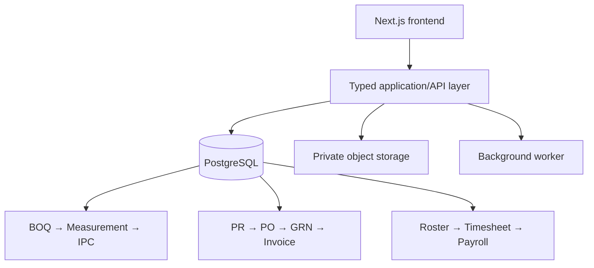

Done—the ECMS design now models the full construction-control cycle, not merely document storage or project tracking.

### Recommended MVP architecture

Use:

* Existing Next.js/TypeScript frontend shell.
* Better Auth for authentication.
* Prisma for ordinary CRUD and transactions.
* PostgreSQL migrations for constraints, triggers, RLS, immutable ledgers, payment gates, partial indexes, and reporting views.
* Object storage for contracts, drawings, invoices, photos, and certificates.
* Background worker for Excel imports, OCR, document previews, reports, notifications, and advisory AI analysis.

### Main frontend areas

* Overview and commercial dashboard
* Contract clauses, obligations, securities, and configurable rules
* BOQ explorer and variation register
* Field measurements with chainage and evidence
* IPC preparation, reconciliation, certification, and payment
* Purchase requisitions, quote comparison, purchase orders, GRNs, invoices, and three-way matching
* Warehouse stock ledger, material issues, and stock counts
* Worker roster, attendance, timesheets, payroll, and worker payments
* Drawing/document register, RFIs, and inspections
* Fraud-control exception console
* Human-reviewed AI findings
* Import and data-reconciliation center

### Three separate payment streams

| Stream                | Required gate                                                            |
| --------------------- | ------------------------------------------------------------------------ |
| Employer → Contractor | Engineer-certified, calculated, and locked IPC                           |
| Contractor → Supplier | Approved supplier + PO + accepted GRN + invoice + passed three-way match |
| Contractor → Worker   | Active roster + approved timesheet + approved payroll                    |

They share reporting but have separate tables, permissions, workflows, approvers, and payment records.

### PostgreSQL implementation

The schema contains:

* 99 relational tables
* 9 reporting views
* 23 database functions
* 27 triggers
* 87 indexes
* UUID identities and `numeric` commercial values
* Immutable audit, workflow-action, source-lineage, and stock-ledger records
* Row-level-security helpers
* Optimistic locking
* Source-cell/page lineage
* Configurable contract rules, including VAT split, retention, advance recovery, price adjustment, and IPC minimums

Database-enforced controls include:

* No supplier self-approval
* No requester/approver/receiver combination
* No PO for an unapproved supplier
* No supplier payment without a passed three-way match
* No negative stock
* No undocumented stock-balance editing
* No unlisted worker on attendance or timesheets
* No timesheet/payroll self-approval
* No worker payment without approved payroll
* No contractor payment without a locked certified IPC
* No payment recorded by the same person who certified/approved it
* AI findings cannot approve, post, certify, or pay anything

The DDL passed PostgreSQL parsing and executable database validation, including procurement, stock, payroll, and IPC control-gate tests.

### Deliverables

* [ECMS MVP Technical Blueprint](sandbox:/workspace/scratch/41d88011bd69/outputs/ecms_mvp/technical/ECMS_MVP_Technical_Blueprint.md)
* [Executable PostgreSQL Schema](sandbox:/workspace/scratch/41d88011bd69/outputs/ecms_mvp/technical/ecms_mvp_postgresql.sql)

The recommended implementation order is identity/project foundation → BOQ and measurements → IPC engine → procurement/stores and documents in parallel → workforce/payroll → reporting and controls → AI last.
